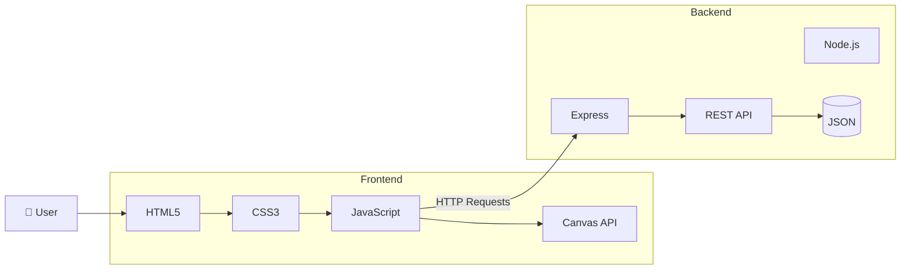
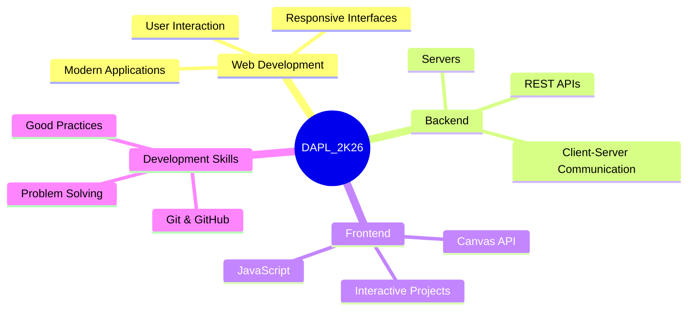

<div align="center">


<br>


<br>

<br>


<br>

---

</div>


# 👨‍💻 About the Repository

The **DAPL_2K26_P2** repository brings together the projects, exercises and practical activities developed throughout the **Application Development** course of the **Technical Course in Systems Development** at the **Francisco Moreira da Costa Electronics Technical School (ETE FMC)**.

The repository covers the main concepts of **Frontend**, **Backend** and **Web Development**, including responsive interfaces built with **HTML, CSS and JavaScript**, interactive applications using the **Canvas API**, and servers and RESTful APIs developed with **Node.js** and **Express**.

**Advisor: Prof. Daniel Mosca**

> [!IMPORTANT]
> Some projects contain their own dedicated **README.md** with more detailed documentation, including architecture, features, implementation details and execution instructions.
>
> | Project | Documentation |
> |:--------:|:-------------:|
> | 💄 **Glow Beauty API** | `Backend/Projeto_MakeServer/README.md` |
> | ⚡ **Electron Hunters** | `Frontend/Projeto_Canvas_V1/README.md` |
> | 🌌 **Canvas Game** | `Frontend/Projeto_Canvas_V2/README.md` |


---

# 🗂️ Table of Contents

- [👨‍💻 About the Repository](#-about-the-repository)

- [📁 Project Structure](#-project-structure)

- [🏗️ Project Architecture](#️-project-architecture)

- [⚙️ Backend](#️-backend)
  - [💄 Glow Beauty API](#-glow-beauty-api)

- [🌐 Frontend](#-frontend)
  - [🎮 Featured Projects](#-featured-projects)

- [▶️ How to Run](#️-how-to-run)

- [🎯 Learning Objectives](#-learning-objectives)

- [📈 Repository Status](#-repository-status)


---

# 📁 Project Structure

```text
DAPL_2K26_P2/

│
├── Backend/
│   ├── Framework_Express/
│   ├── nodeJS/
│   └── Projeto_MakeServer/
│
├── Frontend/
│   ├── Desafios/
│   ├── Exemplos_Canvas/
│   ├── Exercicios_Canvas_P1/
│   ├── Exercicios_Canvas_P2/
│   ├── Projeto_Canvas_V1/
│   └── Projeto_Canvas_V2/
│
├── package.json
├── package-lock.json
├── README.md
└── .gitignore
```

---

# 🏗️ Project Architecture

The repository is structured into two main development areas: **Frontend** and **Backend**, representing the complete workflow of modern web applications, from user interfaces to server-side processing and data management.

The **Frontend** is responsible for the visual interface and user interaction, using technologies such as **HTML5**, **CSS3**, **JavaScript** and the **Canvas API** for creating dynamic and interactive applications.

The **Backend** handles server logic, API development and data communication through **Node.js** and **Express**, providing structured services and RESTful APIs for web applications.



---

# ⚙️ Backend

The backend projects focus on developing servers and RESTful APIs using **Node.js** and **Express**, emphasizing HTTP communication, data management and application architecture.

| Project | Description | Technologies | Main Features |
|:-------:|-------------|--------------|----------------|
| 💄 **Glow Beauty API** | REST API that simulates an online makeup store. | Node.js, Express, JSON, Postman | Authentication, product catalog, filtering, inventory management and shopping cart |

> [!TIP]
> The **Glow Beauty API** contains its own dedicated documentation with detailed information about the project architecture, endpoints and execution instructions.

---

# 🌐 Frontend

The frontend projects explore the creation of interactive web applications using **HTML5**, **CSS3**, **JavaScript** and the **Canvas API**, applying concepts related to graphics, animation and user interaction.

| Project | Description | Technologies | Applied Concepts |
|:-------:|-------------|--------------|------------------|
| 🐍 **Snake Game** | Classic Snake game featuring score tracking, player growth and collision mechanics. | HTML5, Canvas API, JavaScript | Game loop, keyboard input, collision detection |
| 🌧️ **Particle Rain** | Interactive particle simulation with a mouse-controlled cloud. | HTML5, Canvas API, JavaScript | Particle systems, animations, mouse events |
| ⚡ **Electron Hunters** | Educational game inspired by Coulomb's Law and electric charge interactions. | HTML5, Canvas API, JavaScript | Computational physics, vectors, collision detection |
| 🌌 **Canvas Game** | Collection game with procedurally generated elements and player movement. | HTML5, Canvas API, JavaScript | Animation, random generation, object interaction |

> [!NOTE]
> Both **Electron Hunters** and **Canvas Game** include dedicated **README.md** files with additional documentation about their implementation and gameplay.

---

# ▶️ How to Run

## 📌 Requirements

Before running the projects, make sure you have the following installed:

- Node.js;
- Visual Studio Code;
- A modern web browser.

---

<details>
<summary><b>⚙️ Running Backend Projects</b></summary>

<br>

Navigate to the desired backend project folder:

```bash
cd Backend/Projeto_MakeServer
```

Install the required dependencies:

```bash
npm install
```

Start the server:

```bash
node app.js
```

The application will start and the server will be available through the terminal.

</details>

<details>
<summary><b>🌐 Running Frontend Projects</b></summary>

<br>

Navigate to the desired frontend project folder:

```bash
cd Frontend/Desafios/Jogo_Snake
```

Open the project:

```text
index.html
```

You can also launch it using:

```text
Live Server
```

to run the application directly in your web browser.

</details>


---

# 🎯 Learning Objectives

This repository documents the practical learning journey in **Application Development**, covering web applications, APIs, interactive projects and software development practices.



---

# 📈 Repository Status

> [!NOTE]
> This repository is currently under active development and will continue to receive new projects, exercises and practical activities throughout the **Application Development** course.
>
> **Current Status:** 🟢 Active Development

---

<div align="center">


<br>

### Developed by

**Tuany Silva Pereira — 34DS**

**Technical Course in Systems Development**

**Francisco Moreira da Costa Electronics Technical School (ETE FMC)**

**Advisor: Prof. Daniel Mosca**

**2026**

</div>
